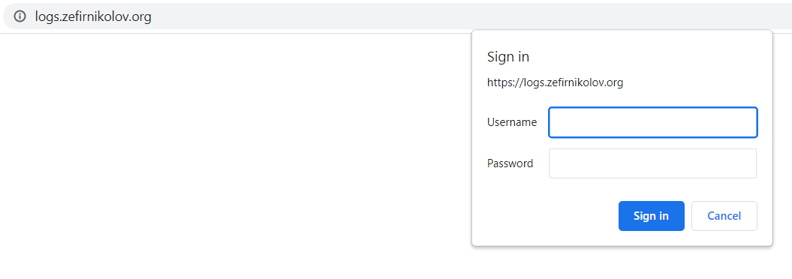

# https://www.zefirnikolov.org

**DevOps** - This a simple **Kubernetes (K8s) cluster** website, which contains **web** + **db** parts – **Facts about the USA**. 
It is deployed on **Google Cloud Platform (GCP)** with **Google Kubernetes Engine (GKE)**. The Cluster is **Production Standard**.

The **database part** is standard **MariaDB (MySQL)** database which is downloaded as a container, added the init file and then created as Docker Image and uploaded to **Docker Hub again** (See the **database-development** files). It is deployed with the **db.yaml** file. The Persistence of the cluster is insured with the **volume-claim.yaml** which reserves a **google pd-standard volume** with 2Gi in case of the db’s container or pod failure – see the **volume-claim.yaml** file.
The **web part** is a .php file in which the connection is made with the Database and the table **states** from it is exposed on the frontend. See the **webpart-development folder**. Then it's files are containerized with - **Nginx web server** with **Php** as a programming language combined in 1 docker image: **webdevops/php-nginx**. The web files are uploaded and a new docker image is created from the **Dockerfile** responsible to the deployment on the cluster. 
Then it is deployed on the cluster with the **web.yaml** file. For persistence 2 replicas are made. 

The front end is exposed to the internet with **Nginx Ingress Controller** and **Let’s Encrypt TLS/SSL** certificates are obtained with **Cert-Manager**. The ingress object to which they are applied is **public-ingress-production.yaml** in the **nginx-ingress-plus-cert-manager** folder of the repository (all cert-manager files are in that folder too). The front end trough the ingress controller’s load balancer (and my Domains management) is obtaining the DNSs – **https://zefirnikolov.org** and **https://www.zefirnikolov.org**

Also another ingress object is created and applied to the ingress – **private-ingress-production.yaml** in the **nginx-ingress-plus-cert-manager** folder of the repository – which applies a **Basic Authentication** and is made only for private entries – **New certificates** are obtained with the Cert Manager and a **new subdomain** is obtained to the DNS for this private entry: **https://logs.zefirnikolov.org**. It requires a username and a password for entry on the DNS.

When enetered with the correct username and password - It's opening the **Kibana** UI - part of the **monitoring** of the cluster. The monitoring is separate **HELM INSTALLATIONS** of **Elastic Stack** - On the Cluster it's installed: **Elasticsearch**, **Kibana** and **Beats** - **Filebeat**, **Metricbeat** and **Heartbeat**. The files and **values.yaml** of all Elastic stack helm installations are in the **elk-helm-install** folder of the repository.

